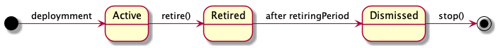
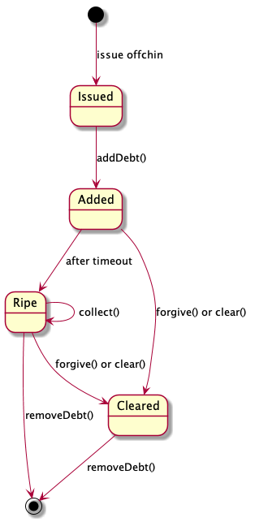

.. toctree::
   :maxdepth: 3
   :caption: Contents:

   
=================
Technical Design
=================

The document specifies in technical terms the contract before implementation is started. It establishes proper states and state transitions for the functions to operate upon. The document organises the description in blocks that are semantically related.

Rationale for the contract and choice of functions could be found in `Informal overview`_.

.. _`Informal overview`: overview.html
----------------
Debt Contract
----------------

~~~~~~~~~~~~~~~~~~~~~~
Contract Lifecycle
~~~~~~~~~~~~~~~~~~~~~~

After deployment the contract is in *Active* state. It accepts deposits, withdrawals, and is able to add debts. Eventually an owner of the contract decides to stop using the contract. First, the person calls 'retire()' to indicate that the contract starts a final call for accepting the debts. It starts a retirement period. After it is over, the contract is in dismissed state. It means no new debts could be accepted, only repaid. While in dismissed state the owner is free to deposit and withdraw funds, as well as repay the debts. Once all of the debts are repaid, the contract could be stopped. Effectively this destroys the contract.
::

  constructor(uint256 _retiringPeriod, address _clearingHouse) public

Initialise the contract, set an initial owner, set the 'retiringPeriod' in seconds, and address of *ClearingHouse* contract.
::

  currentState() public returns (State)

Indicates if the channel is in *Active*, *Retired*, or *Dismissed* state.
::

  retire(bytes memory _signature) public

Moves the contract in 'Retired' state. Checks if signature corresponds to owner's command to retire.
::

  stop() public

Checks if the contract is in Dismissed state, balance is zero, all the debts are clear. If the conditions are satisfied, calls 'selfdestruct' on the contract.

~~~~~~~~~~
Ownership
~~~~~~~~~~

The contract supports multiple addresses as the owners. In this case we decided to utilize functions from OpenZeppelin's Roles.sol.

Functions:
::

  isOwner(address _address) public returns bool

Check if the passed address is in the list.
::

  addOwner(address _newOwner, bytes memory _signature) public

Add **_owner** to the list. Checks if signature corresponds to one of the owners' command: allowed for the owner only.
::

  removeOwner(address _owner, bytes memory _signature) public

Remove **_owner** from the list. Check if signature corresponds to one of the owners' command: allowed for the owner only.

~~~~~~~~~~
Delegates
~~~~~~~~~~

The contract supports multiple delegate signers that are permitted to sign, or issue debt. A delegate signer can sign the debt only.  In this case we decided to utilize functions from OpenZeppelin's SignerRole.sol.
::

  isSigner(address _address) public returns bool

Check if the passed address is in the list.
::

  addSigner (address _signer, bytes memory _signature) public

Add **_signer** as delegate key to the list. Check if signature corresponds to one of the owners' command: allowed for the owner only.
::

  removeSigner (address _signer, bytes memory _signature) public

Remove **_signer** as delegate key from the list. Check if signature corresponds to one of the owners' command: allowed for the owner only.

~~~~~~
Funds
~~~~~~

For repayment, the owner of the contract should be able to deposit money to the contracts. If deposited in excess, the owner could withdraw the remaining funds.

The contract tracks balance:
::

    mapping (address => uint256) public balance;

Here 'address' key is an address of token contract. 'uint256' value is balance in the corresponding token. The mapping tracks Ether via special '0x00' token contract address.
::

    'deposit (address _token, uint256 _amount, address _sender) public payable'

Move '_amount' of '_token' tokens from '_sender' to the contract. If '_token' is '0x00' then just update 'balance' mapping. Anyone can deposit.
::

    'withdraw (address _destination, address _token, uint256 _amount, bytes memory _signature) public'

Move '_amount' of '_token' tokens from the contract to '_destination'. If '_token' is '0x00', move Ether. Check if signature corresponds to one of the owners' command: allowed for the owner only.

~~~~~
Debt
~~~~~

Here comes block of functions that manage debt. Debt itself is tracked via
::

    mapping (bytes32 => Debt) public debts;

Here key 'bytes32' is an identifier of the 'Debt' entry. Debt identifier number is calculated by 'debtIdentifier' function below.::
::

  struct Debt {
    	address destination;
    	address token;
    	uint256 collectionAfter;
    	uint256 amount;
    	uint16  salt;
  }

'Debt' data structure keeps track of amount, and time when the debt is ripe for collection:

* 'destination' – address of creditor contract,
* 'token' – address of token contract,
* 'collectionAfter' – when the debt is ripe for collection,
* 'amount' – amount of tokens,
* 'salt' – thing that uniquely identifies the debt between the parties, and sets debt id.

Reason for 'collectionAfter' inclusion is one could extend debt over time, and update the entry on chain before 'collectionAfter'.

Debt goes through certain lifecycle stages:

Here go related functions in the contract:

* 'debtIdentifier(address _destination, address _token, uint16 _salt) public returns (bytes32)'

Calculate debt identifier, as 'uint256(keccak256(address(this), _destination, _token, _salt))'

* 'addDebt(address _destination, address _token, uint256 _amount, uint16 _salt, uint256 _settlementPeriod, bytes memory _sigDebtor, bytes memory _sigCreditor) public'

Add debt entry. Owner of the contract is indebted to '_destination' contract with '_amount' of '_token' tokens. '_settlementPeriod' sets '_collectionAfter' entry. The signatures prove both party agree on the terms.

Before adding check if the debt has not been cleared in the ClearingHouse.

Reminder: debt could only grow.

* 'collectDebt(bytes32 _id, bytes memory _signature) public'

Move funds from debt, identified by '_id', as repayment. All the existing tokens on the balance are moved there. This reduces total amount of the debt.

Check if happens after 'debt.collectionAfter'.

Before collecting check if the debt has not been cleared in the ClearingHouse.

* 'forgiveDebt(bytes32 _id, bytes memory _signature) public'

Unilaterally clear debt. Go to clearing house, and call 'forgive()' there. Remove the entry from the 'debts' list.

Check if signature corresponds to one of the '_destination' owners' command: allowed for them only.

* 'removeDebt(bytes32 _id) public'

If the debt has been cleared in the ClearingHouse, or fully repaid, remove the entry from the database.

* 'onCollectDebt(address _token, uint256 _amount, bytes32 _id)'

This is called inside 'collect' of a counter-party. Works like deposit for collected funds. For a basic scenario transfers tokens from the caller, and sets it onto deposit. For a case with unbundling adjusts corresponding debts according to internal rules.

* 'addDebtDigest (address _destination, address _token, uint256 _amount, uint256 _settlementPeriod)'

Generates datahash for signatures using as 'addDebt' method's arguments.

~~~~~~~~~~~~~~~
Clearing House
~~~~~~~~~~~~~~~

A debt in our system could only grow. In real life though, we see bidirectional flow of funds, and bidirectional flow of debts. This means, at some time, we would like to clear debt channels against each other. For this, we introduce another contract *ClearingHouse.*

It tracks clearing information::
      mapping (address => mapping (bytes32 => bool)) public cleared;

Here the first 'address' key is address of debt contract, 'bytes32' is debt identifier. 'bool' value indicates whether the debt is cleared.

This supports following functions:

* 'clear(address _partyA, address _partyB, bytes32 _idA, bytes32 _idB, bytes memory _sigA, bytes memory _sigB) public'

Adds entry to the cleared list for '_partyA' and '_partyB'. Check if signature corresponds to both of the parties' command. Check if both contracts use the same clearing house.

* 'isCleared(address _party, bytes32 _id)'

Returns true if the debt is cleared.

* 'forgive(bytes32 _id) public'

Clear the debt identified by '_id' on debt contract with address 'msg.sender'. Thus, the call could only go from the debt contract.

~~~~~~~~~~~~~~~~~~~~~~~~~
Notes for Implementation
~~~~~~~~~~~~~~~~~~~~~~~~~

Keep in mind it is beneficial to have meta transactions, that is messages signed by the user, but relayed by someone else.

It is good to optimise for contract size: use libraries, for example.

General note regarding 'bytes _signature' parameter. It works according to suffix signature type pattern. That is the last byte of the signature indicates what type of signature this is. For example, '0x00' indicates 'msg.sender' is expected as recovered, '0x01' indicates ethereum signature, '0x02' indicates EIP712 signature. See [LibService](https://github.com/machinomy/plasmoid/blob/master/contracts/LibService.sol) and [LibStructs](https://github.com/machinomy/plasmoid/blob/master/contracts/LibStructs.sol#L68) from our Plasmoid attempt. Also MSignatureValidator.sol_ and MixinSignatureValidator.sol_ from ZeroEx.

.. _MixinSignatureValidator.sol: https://github.com/0xProject/0x-monorepo/blob/9b521aeef5ed35b3e9d9926dac1da4d8a3648e50/contracts/protocol/contracts/protocol/Exchange/MixinSignatureValidator.sol
.. _MSignatureValidator.sol: https://github.com/0xProject/0x-monorepo/blob/9b521aeef5ed35b3e9d9926dac1da4d8a3648e50/contracts/protocol/contracts/protocol/Exchange/mixins/MSignatureValidator.sol

.. |date| date:: %d.%m.%Y

Текущая дата |date|

* :ref:`genindex`
* :ref:`search`