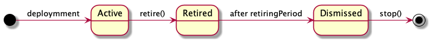
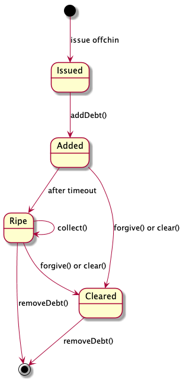

=========================
 Holding Contract Design
=========================

The document specifies in technical terms the contract. It establishes proper states and state
transitions for the functions to operate upon. The document organises the description in blocks that are semantically related.

Rationale for the contract and choice of functions could be found in `Overview`_.

.. _`Overview`: overview.html

~~~~~~~~~~~~~~~~~~~~
 Contract Lifecycle
~~~~~~~~~~~~~~~~~~~~

After deployment the contract is in *Active* state. It accepts deposits, withdrawals, and is able to add debts.
Eventually an owner of the contract decides to stop using the contract.
First, the person calls `retire()` to indicate that the contract starts a final call for accepting the debts.
It starts a retirement period. After it is over, the contract is in dismissed state.
It means no new debts could be accepted, only repaid. While in dismissed state the owner is free to deposit
and withdraw funds, as well as repay the debts. Once all of the debts are repaid, the contract could be stopped.
Effectively this destroys the contract.

.. code-block:: solidity

  constructor(uint256 _retiringPeriod, ClearingHouse _clearingHouse) public

Initialise the contract, set an initial owner, set the 'retiringPeriod' in seconds, and address of *ClearingHouse* contract.

.. code-block:: solidity

  currentState() public returns (State)

Indicates if the channel is in *Active*, *Retired*, or *Dismissed* state.

.. code-block:: solidity

  retire(bytes memory _signature) public

Moves the contract in 'Retired' state. Checks if signature corresponds to owner's command to retire.

.. code-block:: solidity

  stop() public

Checks if the contract is in Dismissed state, balance is zero, all the debts are clear.
If the conditions are satisfied, calls `selfdestruct` on the contract.

~~~~~~~~~~~
 Ownership
~~~~~~~~~~~

The contract supports multiple addresses as the owners. In this case we decided to utilize
functions from OpenZeppelin's `Roles.sol`.

Functions:

.. code-block:: solidity

  isOwner(address _address) public returns bool

Check if the passed address is in the list.

.. code-block:: solidity

  addOwner(address _newOwner, bytes memory _signature) public

Add `_owner` to the list. Checks if signature corresponds to one of the owners' command: allowed for the owner only.

.. code-block:: solidity

  removeOwner(address _owner, bytes memory _signature) public

Remove `_owner` from the list. Check if signature corresponds to one of the owners' command: allowed for the owner only.

~~~~~~~~~~~
 Delegates
~~~~~~~~~~~

The contract supports multiple delegate signers that are permitted to sign, or issue debt.
A delegate signer can sign the debt only.  In this case we decided to utilize functions from OpenZeppelin's `SignerRole.sol`.

.. code-block:: solidity

  isSigner(address _address) public returns (bool)

Check if the passed address is in the list.

.. code-block:: solidity

  addSigner (address _signer, bytes memory _signature) public

Add `_signer` as delegate key to the list. Check if signature corresponds to one of the owners' command:
allowed for the owner only.

.. code-block:: solidity

  removeSigner (address _signer, bytes memory _signature) public

Remove `_signer` as delegate key from the list. Check if signature corresponds to one of the owners' command:
allowed for the owner only.

~~~~~~~
 Funds
~~~~~~~

For repayment, the owner of the contract should be able to deposit money to the contracts.
If deposited in excess, the owner could withdraw the remaining funds.

The contract tracks balance:

.. code-block:: solidity

    mapping (address => uint256) public balance

Here `address` key is an address of token contract. `uint256` value is balance in the corresponding token.
The mapping tracks Ether via special `0x00` token contract address.

.. code-block:: solidity

    deposit (address _token, uint256 _amount, address _sender) public payable

Move `_amount` of `_token` tokens from `_sender` to the contract. If `_token` is `0x00` then just update `balance` mapping.
Anyone can deposit.

.. code-block:: solidity

    withdraw (address _destination, address _token, uint256 _amount, bytes memory _signature) public

Move `_amount` of `_token` tokens from the contract to `_destination`. If `_token` is `0x00`, move Ether.
Check if signature corresponds to one of the owners' command: allowed for the owner only.

~~~~~~
 Debt
~~~~~~

Here comes block of functions that manage debt. Debt itself is tracked via

.. code-block:: solidity

    mapping (bytes32 => Debt) public debts;

Here key `bytes32` is an identifier of the `Debt` entry. Debt identifier number is calculated by `debtIdentifier` function below.

.. code-block:: solidity

  struct Debt {
    	address destination;
    	address token;
    	uint256 collectionAfter;
    	uint256 amount;
    	uint16  nonce;
  }

`Debt` data structure keeps track of amount, and time when the debt is ripe for collection:

* `destination` – address of creditor contract,
* `token` – address of token contract,
* `collectionAfter` – when the debt is ripe for collection,
* `amount` – amount of tokens,
* `nonce` – thing that uniquely identifies the debt between the parties, and sets debt id.

Reason for `collectionAfter` inclusion is one could extend debt over time, and update the entry on chain before `collectionAfter`.

Debt goes through certain lifecycle stages:

Here go related functions in the contract:

.. code-block:: solidity

  debtIdentifier(address _destination, address _token, uint16 _nonce) public returns (bytes32)

Calculate debt identifier, as `keccak256(abi.encode(address(this), _destination, _token, _nonce))`.

.. code-block:: solidity

  addDebt(address _destination, address _token, uint256 _amount, uint16 _nonce, uint256 _settlementPeriod, bytes memory _sigDebtor, bytes memory _sigCreditor) public

Add debt entry. Owner of the contract is indebted to `_destination` contract with `_amount` of `_token` tokens.
`_settlementPeriod` sets `_collectionAfter` entry. The signatures prove both party agree on the terms.

Before adding check if the debt has not been cleared in the ClearingHouse. Reminder: debt could only grow.

.. code-block:: solidity

  collectDebt(bytes32 _id, bytes memory _signature) public

Move funds from debt, identified by `_id`, as repayment. All the existing tokens on the balance are moved there.
This reduces total amount of the debt.

Check if happens after `debt.collectionAfter`. Before collecting check if the debt has not been cleared in the ClearingHouse.

.. code-block:: solidity

  forgiveDebt(bytes32 _id, bytes memory _signature) public

Unilaterally clear debt. Go to clearing house, and call `forgive()` there. Remove the entry from the `debts` list.
Check if signature corresponds to one of the `_destination` owners' command: allowed for them only.

.. code-block:: solidity

  removeDebt(bytes32 _id) public

If the debt has been cleared in the ClearingHouse, or fully repaid, remove the entry from the database.

.. code-block:: solidity

  onCollectDebt(address _token, uint256 _amount, bytes32 _id)

This is called inside `collect` of a counter-party. Works like deposit for collected funds.
For a basic scenario transfers tokens from the caller, and sets it onto deposit. For a case with transaction split
adjusts corresponding debts according to internal rules.
