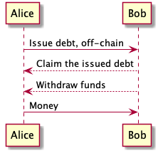

.. toctree::
   :maxdepth: 3
   :caption: Contents:
   
==================
Informal overview
==================

One of the premise that L2 transactional systems operate upon is an assumption of an opaque identity. One could not tell anything about a participant other than she participates in transactions, and has some funds.

In our case a participant has a well known identity. Thus, we could use that lessened constraint to re-engineer a transactional system.

Debt Channel is a payment channel between parties with an established identity. A payment channel works by exchanging promised payments off-chain. The promise is guaranteed by funds that are deposited onto the channel smart contract. If anything happens, after some protocol, a party is free to get her money out of the contract, and out of the channel. All of the possible cases for getting the funds are set in the smart contract. For debt channel, there is a recourse to a real, flesh world, so we instead of doing promised payments a party may promise a debt to be repaid at a later date, and send it off-chain.

To implement this, we need a smart contract for a party that is able to track the claimed debts, and collects the repayments. Essentially it represents on-chain identity of a party.

The contract supports following functions:

* addDebt(issued debt) – track the issued debt on chain
* collect(debt id) – collect the tracked debt, if there are funds on the contract
* deposit() – deposit funds on to the contract
* withdraw() – withdraw funds from the contract by the owner of the contract.

As debt could sometimes be forgiven, the contract contains another function

* forgive() – a debtee forgives the debt

Another aspect is the contract is not able to sign data, so we introduce delegate signing keys. This requires following functions:

* addSigner(address) – add delegate key,
* renounceSigner(addres) – remove delegate key,
* isSigner(address) – check if the address is a proper delegate signing key.

Only *proper owner* could manipulate the signing keys. Thus, the contract manages two types of keys. *Owner* keys, and *delegate* keys. The contract supports this via following functions:

* addOwner(address) – add the address as the owner,
* removeOwner(address) – remove the address as the owner,
* isOwner(address) – check if the address could be the owner.

~~~~~~~~~
Clearing
~~~~~~~~~
One of the must have features is signer does not have to watch the blockchain. We could introduce incrementing nonces that track sequence of steps. With that we would have to introduce some form of timeout before a debt could be considered final so that a counter-party could present a more resent version. This defeats the original point.

So, debt could only grow. To reduce a debt, a counterparty could issue more debt to counterbalance. Eventually, the debt could be cleared, and settled. Thus, the contract has to support clearing and settlement. We introduce then a Clearing contract that tracks the debt ids being cleared against each other.

Clearing contract supports following functions:

* clear(partyA, partyB, debtA, debtB) – clears the debts from parties,
* isCleared(debt id) – checks if the debt is cleared.

Then the debt contract has to respect the clearing rules, and prevent a debt to be accepted.

~~~~~~~~~~~~~~~~~~
Multiple Tokens
~~~~~~~~~~~~~~~~~~
To support multiple tokens we extend a data structure for debt with a field for token address.

Also, we track the tokens deposited in the contract, so that the withdrawal could proceed in the tokens of choice.

~~~~~~~~~~~~~~~~~~
Unbundling
~~~~~~~~~~~~~~~~~~

The unbundling rules could be stored in the contract, and be activated on time of withdrawal. The contract tracks the funds. A transfer, i.e claiming debt, happens between the contracts. We mandate an indebted contract to notify the debtee contract about the transfer, so that the latter could adjust its debts according to unbundling rules.

For this the contract should support following function:

* onCollect() – accept collected funds and adjust debts data structure.

The function should be called by an indebted contract when *collect* is called.

~~~~~~~~~~~~~~~~~~
Multiple Hops
~~~~~~~~~~~~~~~~~~

We do not have to worry about multiple hops, as the debt as a form of payment is one-direction only, does not require hopping. The payment could be sent freely through any transport.

~~~~~~~~~~~~~~~~~~~~~~~~~~~
Contract Lifecycle
~~~~~~~~~~~~~~~~~~~~~~~~~~~
We envision the debt contracts not being used for ever. Thus, the contract has to be stopped at some time. For this we add one more function to the contract:

* retire() – start end of life period for the contract,
* stop() – destroy the contract.

*retire* initiates an end of life period. After the period is over, no new debts could be added. One could only repay the existing debts.

When all the debts are cleared, and the contract balance is empty, one could call *stop* to finally destroy the contract.

.. |date| date:: %d.%m.%Y

Текущая дата |date|

* :ref:`genindex`
* :ref:`search`